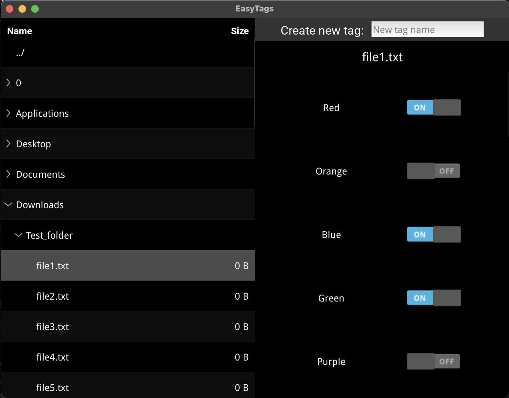

# Easy Tags


Easy Tags is a graphical user interface (GUI) application designed to simplify the management of Finder tags on macOS. With Easy Tags, users can effortlessly add, remove, and create new tags for files, enhancing the organization and accessibility of their data.

This project was developed as my final project for [Harvard's CS50 course](https://cs50.harvard.edu/x/2023/project/).

## Features

- **User-Friendly Interface:** Easy Tags provides an intuitive GUI with a file explorer on the left, a tag input box on the top-right, and a tag list with status switches on the right.

- **Tag Management:** Easily add or remove tags from selected files using the convenient interface.

- **Tag Creation:** Users can create new tags on-the-fly by entering tag names in the input box.

- **Visual Feedback:** The status switches visually indicate the presence of tags on selected files, making it easy to identify tagged items.

- **Language Support:** English and Chinese

## Getting Started

Before running Easy Tags, ensure that your system meets the following requirements:

**Package Version:**
- Python 3.10.4
- Kivy Version: 2.2.1

**Run Application:**
```zsh
./setup
```

## Dependencies

- [Kivy](https://kivy.org/): Open-source Python library for developing multitouch applications.
